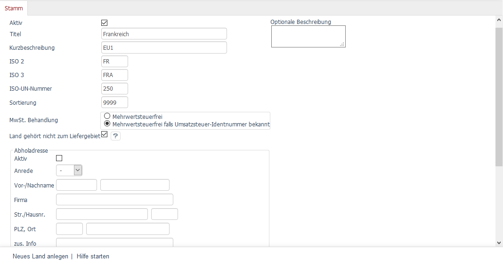
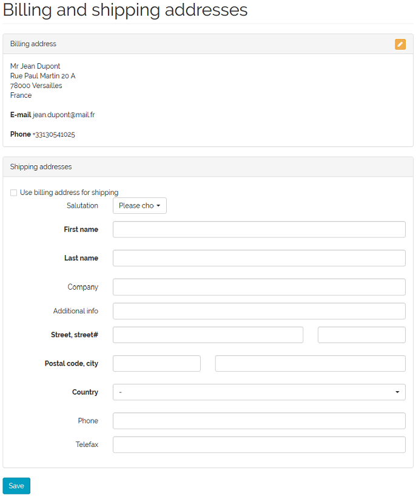
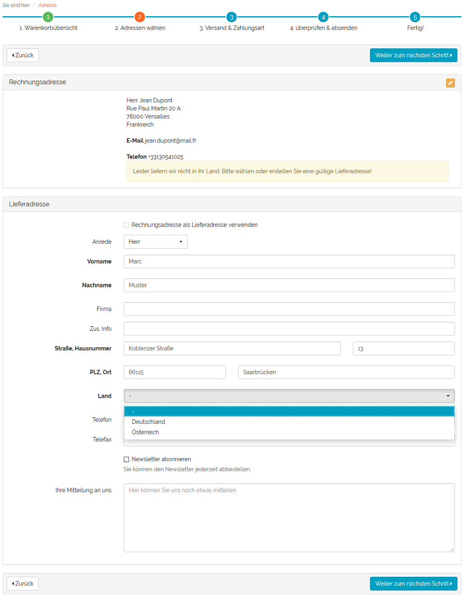
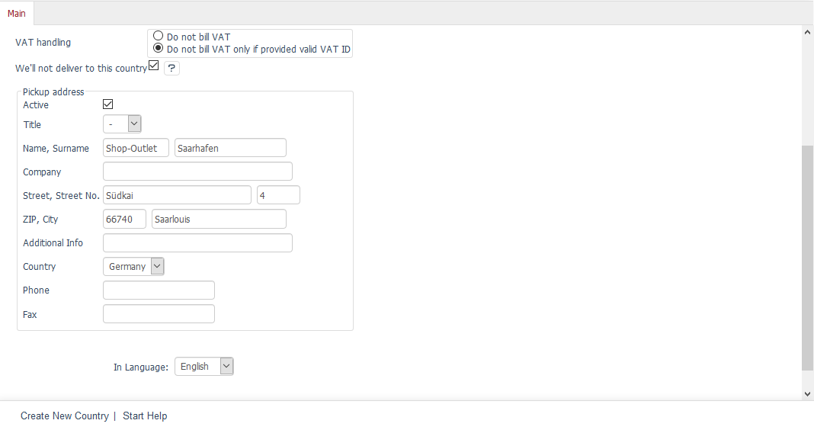
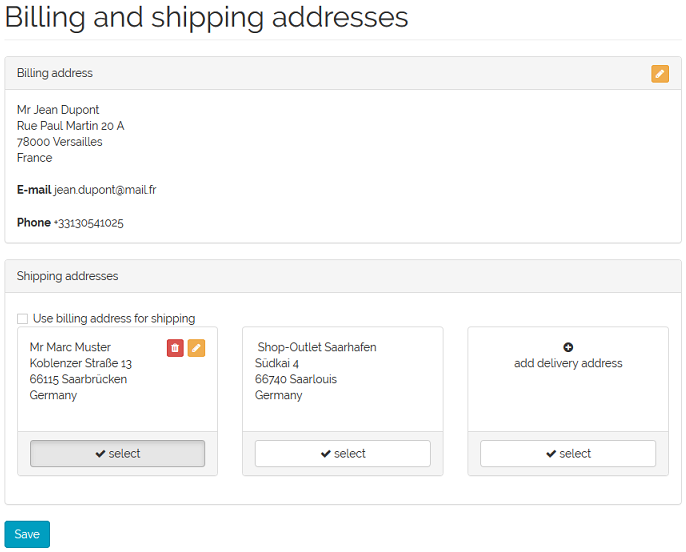

Function description
====================

The module provides additional settings on the :guilabel:`Main` tab of the countries section. Countries can be edited under :menuselection:`Master Settings` in the Admin panel. If a country is activated, this means by default that customers from that country can order in the shop and that ordered goods are delivered to that country.

Shipping addresses in countries within the delivery area
--------------------------------------------------------
The box :guilabel:`We’ll not deliver to this country` can be checked to exclude delivery to this country. According to the Geo-blocking Regulation (EU 2018/302), shop owners are required to accept orders from all European Member States, but are not required to deliver to all of these countries. All they need to do is allow the goods to be picked up by the customer within the delivery area.

In the frontend, this setting for the countries can be found in different places.

Let’s assume that a customer visits the shop from a country outside of the delivery area. When he or she opens an account, the customer registration is done as usual. There are no restrictions.

But, when he or she logs on to the shop at a later date and goes to :menuselection:`My account --> Billing and shipping addresses`, the form for entering a shipping address will be displayed below the billing address specified during registration. The box :guilabel:`Use billing address for shipping` cannot be checked.

At this point, the customer can enter a shipping address that is in a country to which delivery is made. Only these countries can be selected in the :guilabel:`Country` drop-down list.

However, when placing an order in the shop, the customer will have to specify a valid shipping address. In step 2 of the ordering process, a message will appear and the ordering process will not continue without a valid shipping address. Here too, the box :guilabel:`Use billing address for shipping` can’t be checked.

When the customer proceeds to step 3 in the ordering process, the shipping address is stored in the account settings. If necessary, this shipping address can be changed under :menuselection:`My account --> Billing and shipping addresses` or another one added.

--------------------------------------------------

Pickup addresses in countries within the delivery area
------------------------------------------------------
As a special offer to their customers, shop owners can define one pickup address per country, which is within the delivery area. The pickup address is also stored in the :guilabel:`Main` tab of the countries section.

The pickup address is displayed with the shipping addresses in the shop’s frontend. Unlike a regular shipping address, the pickup address cannot be edited or deleted.

.. Internal: oxdaat, status: