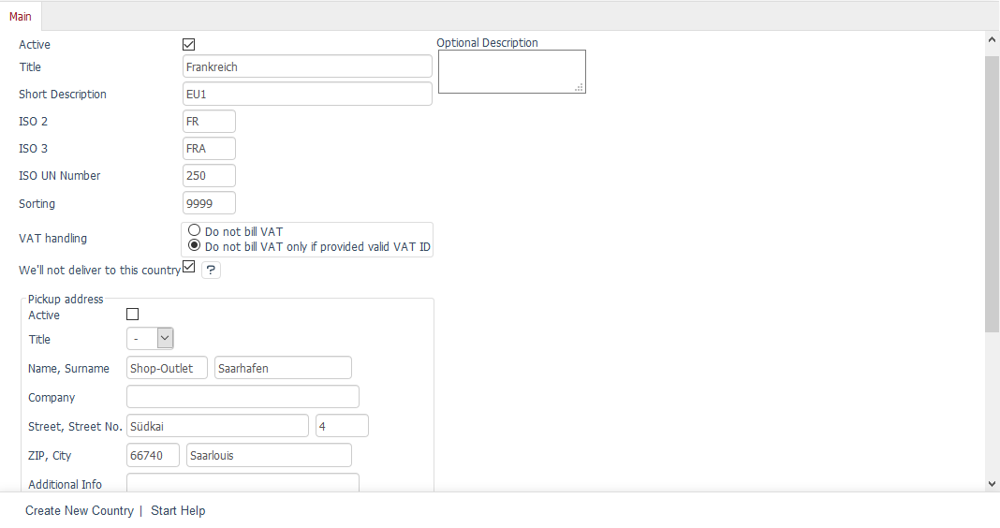
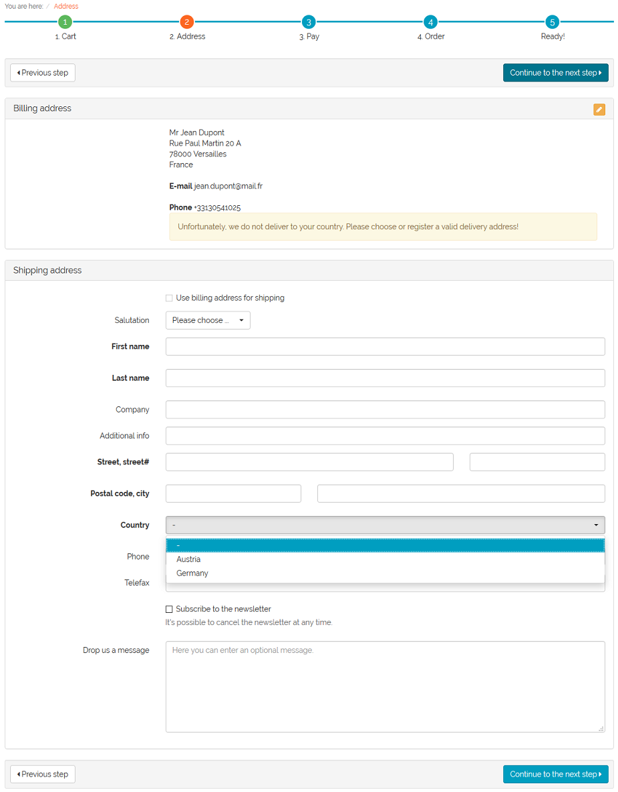
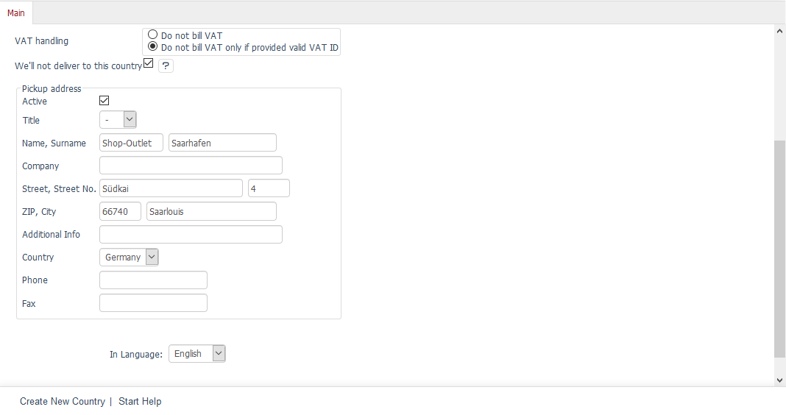
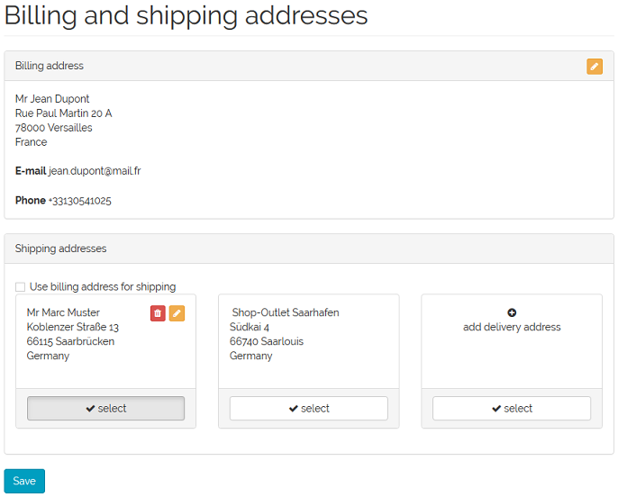

Funktionsbeschreibung
=====================

Das Modul erweitert die Einstellungen auf der Registerkarte :guilabel:`Stamm` der Länder. Länder können im Administrationsbereich unter :menuselection:`Stammdaten` bearbeitet werden. Ist ein Land aktiviert, bedeutet das standardmäßig, dass Kunden aus diesem Land im Shop bestellen können und dass bestellte Waren in dieses Land geliefert werden.

Lieferadressen in Ländern aus dem Liefergebiet
----------------------------------------------
Das Kontrollkästchen :guilabel:`Land gehört nicht zum Liefergebiet` kann aktiviert werden, um eine Lieferung in dieses Land auszuschließen. Laut der Geoblocking-Verordnung (EU 2018/302) müssen Shopbetreiber bekanntlich Bestellungen aus allen europäischen Mitgliedsstaaten zulassen, sind jedoch nicht verpflichtet, auch in alle diese Länder zu liefern. Es genügt, wenn sie die Abholung der Ware durch den Kunden innerhalb ihres Liefergebietes ermöglichen.

Im Frontend zeigt sich diese Einstellung bei den Ländern an unterschiedlichen Stellen.

Wir gehen von einem Kunden aus, der den Shop aus einem nicht zum Liefergebiet gehörenden Land besucht. Wenn er ein Konto eröffnet, kann er sich als Kunde ganz normal registrieren. Es gibt keinerlei Einschränkungen.

Meldet er sich zu einem späteren Zeitpunkt im Shop an und wechselt in den Bereich :menuselection:`Mein Konto --> Rechnungs- und Lieferadressen`, wird ihm unterhalb der bei der Registrierung angegebenen Rechnungsadresse das Formular zur Angabe einer Lieferadresse angezeigt. Das Kontrollkästchen :guilabel:`Rechnungsadresse als Lieferadresse verwenden` kann nicht aktiviert werden.

.. image:: media/screenshots/oxdaat02.png
   :alt: Mein Konto, Rechnungs- und Lieferadressen
   :height: 772
   :width: 650

Der Kunde kann an dieser Stelle bereits eine Lieferadresse hinterlegen, die in einem Land liegt, in welches geliefert wird. Nur diese Länder sind in der Dropdown-Liste :guilabel:`Land` des Formulars auswählbar.

Spätestens bei einer Bestellung im Shop muss der Kunde aber eine in diesem Sinne gültige Lieferadresse angeben. Im Bestellschritt 2 wird er durch eine Meldung darauf hingewiesen und kann ohne gültige Lieferadresse den Bestellprozess nicht fortsetzen. Auch hier ist es nicht möglich, das Kontrollkästchen :guilabel:`Rechnungsadresse als Lieferadresse verwenden` zu aktivieren.

Die Lieferadresse wird beim Wechsel zum Bestellschritt 3 in seinen Kontoeinstellungen gespeichert. Bei Bedarf kann diese Lieferadresse unter :menuselection:`Mein Konto --> Rechnungs- und Lieferadressen` geändert oder eine weitere hinzugefügt werden.

--------------------------------------------------

Abholadressen in Ländern aus dem Liefergebiet
---------------------------------------------
Als ein besonderes Angebot an seine Kunden kann der Shopbetreiber eine Abholadresse pro Land definieren, welches zum Liefergebiet gehört. Die Abholadresse wird auch auf der Registerkarte :guilabel:`Stamm` der Länder hinterlegt.

Im Frontend des Shops wird die Abholadresse bei den Lieferadressen angezeigt. Im Gegensatz zu einer normalen Lieferadresse kann die Abholadresse nicht bearbeitet oder gar gelöscht werden.

.. Intern: oxdaat, Status: